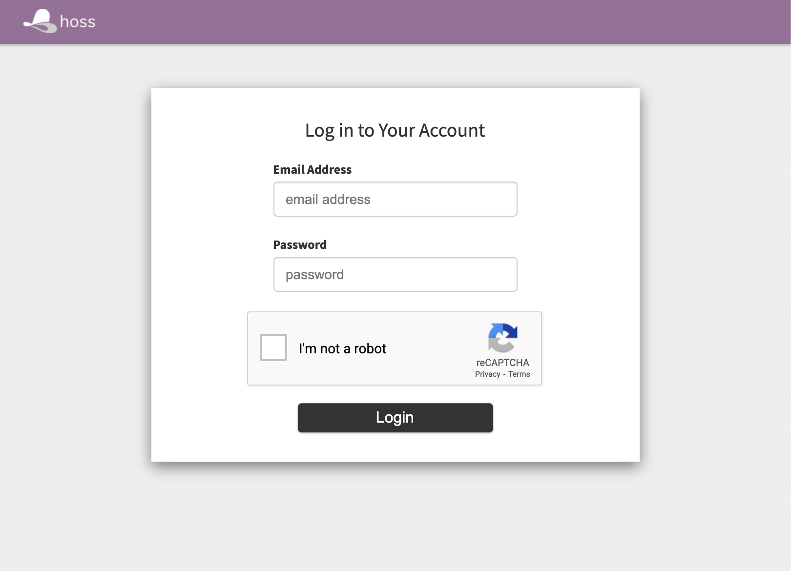

# reCAPTCHA

Dex has been modified to support Google's reCAPTCHA v2 in the integrated login screen. This only applies to cases where LDAP is being used, which results in Dex login page.

To enable the Google reCAPTCHA widget, the env var `RECAPTCHA_SITE_KEY` must be set. If this is set, then when `make config` is run,
`dex/password-captcha.html` will be copied into the working directory at `~/.hoss/auth/web/templates` to be served. If not, `dex/password.html` will be used, which does not include the reCAPTCHA code.

Similarly, if `RECAPTCHA_SITE_KEY` is set `config-dex-captcha.tmpl` will be rendered and appended to the dex config file at `~/.hoss/auth/config-dex.yaml`. If not, `config-dex-no-captcha.tmpl` is rendered and appened to the dex config file.

To obtain your site key:

1. Go to [https://www.google.com/recaptcha/admin/create](https://www.google.com/recaptcha/admin/create)
2. Log in with your Google credentials
3. Fill out the form, selecting the reCAPTCHA v2 option with "I'm not a robot" Checkbox
4. Enter the domain you expect to use. If developing, be sure to include localhost
5. Set `RECAPTCHA_SITE_KEY` and `RECAPTCHA_SECRET_KEY` to the provided values