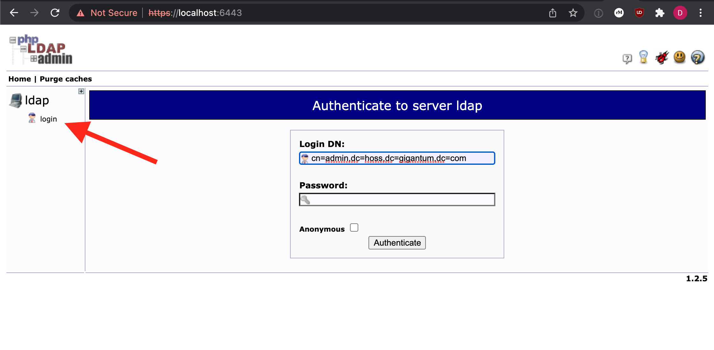
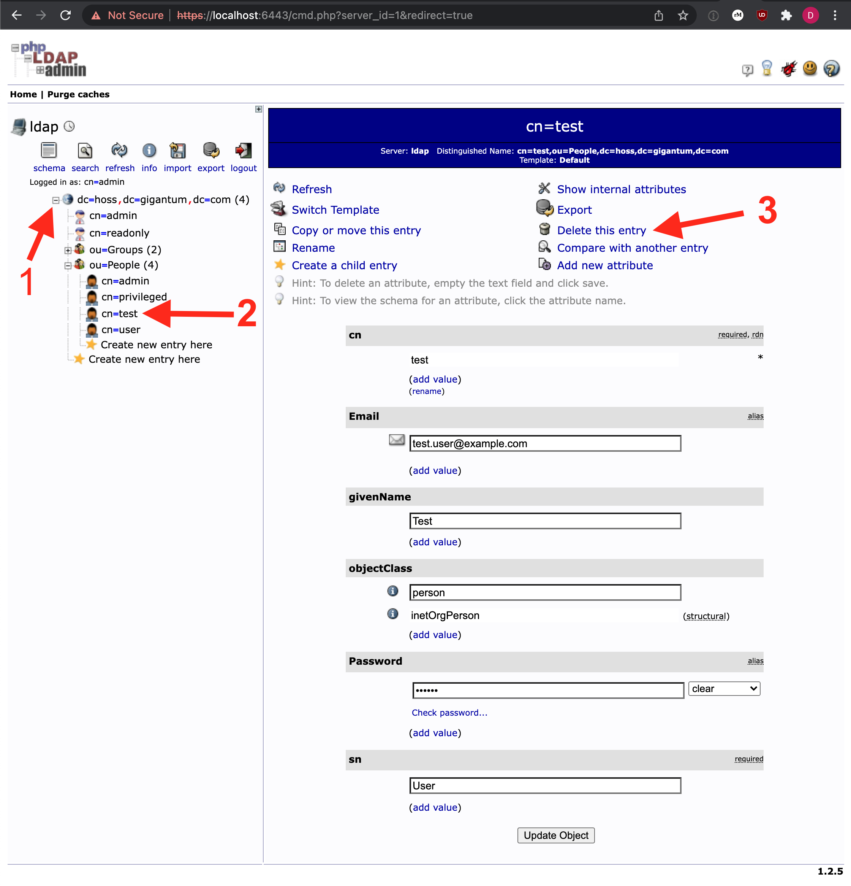
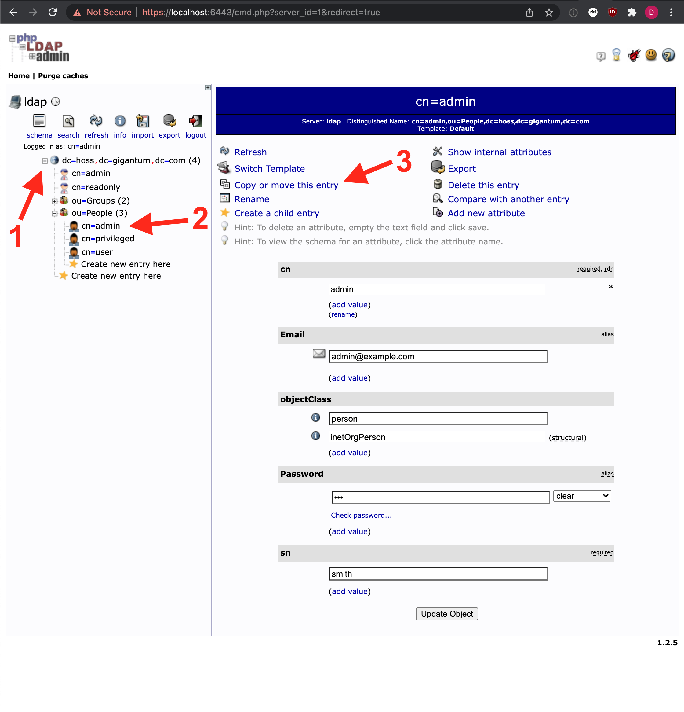
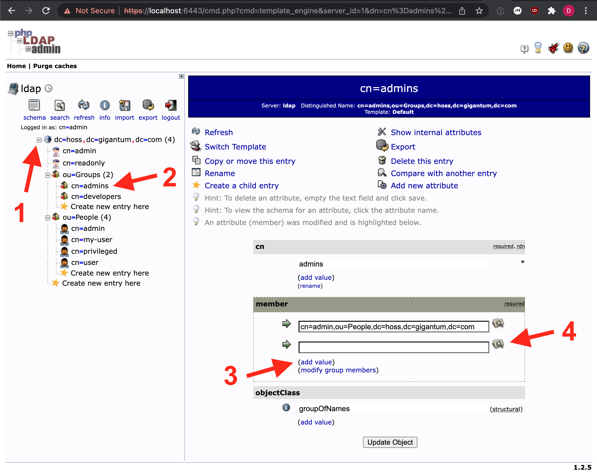

# Internal LDAP Server

```{warning}
You must always remember to remove test accounts, as shown below, when running a Hoss server that
is exposed to the public internet. If you fail to do this, anyone will be able to access the server.
```

Using the internal LDAP server is optional, and enabled by default, as it is used during development
and testing. When enabled, the system will "work out of the box". There is a simple UI to manage the
LDAP server, accessible only to administrators with access to the host machine.


## Accessing Admin UI
The LDAP administrator UI is only served locally on port `6443` and must be accessed from the host. Typically this
can be done via SSH + port forwarding. For example:

```
$ ssh -i ~/.ssh/mykey.pem -L 6443:localhost:6443 username@hoss.my-server.com
```

After this command, visit `https://localhost:6443` in your browser. You will get a warning due to self-signed
certificates that is OK to accept. Once the page loads, you will see the "phpLDAPadmin" page. Click on the "login"
link on the left side of the page.




The username should already be defaulted to the correct value for your server. For example, by default it will be
`cn=admin,dc=hoss,dc=gigantum,dc=com` where the `LDAP_DOMAIN` in `~/.hoss/.env` is `hoss.gigantum.com`. 

The password is available in the `~/.hoss/.env` file as `LDAP_ADMIN_PASSWORD`.


## Removing Users
To remove a user, delete the record for the user from the server.

1) Expand the items on the left to reveal "ou=People".
2) Select the desired user (usernames will be visible)
3) Select "Delete this entry"
4) Select "Delete" to confirm




## Adding Users
The easiest way to create a new user is to simply copy one of the test users as starting before the test users are deleted.

1) Expand the items on the left to reveal "ou=People".
2) Select an existing user (usernames will be visible)
3) Select "Copy or move this entry"
4) On the next screen, replace `cn=<selected username>` with `cn=<new username>`
5) Click the "Copy" button
6) Modify the values
   1) Set the email to a unique and correct value
   2) Do not change `objectClass`
   3) Set the password. You should ideally set a hashed password but could temporarily use clear. 
      If the user changes their password after logging in for the first time via the Hoss UI it will be stored as a hashed value.
      For more information on how to generate a hashed password, see the "Generating Hashed Passwords" section below
   4) `sn` stands for surname and is typically the user's family name/last name
   5) Click the "Create Object" button
7) Click the "Commit" button



Optionally, if you wish to also add a first name/given name to your users:

1) Click on "Add new attribute"
2) Select "givenName" from the dropdown that appears
3) Enter a value
4) Click the "Update Object" button at the bottom of the page
5) Click "Update Object" again to confirm

## Applying Roles
Roles are applied by putting users in groups. In the Hoss auth service, groups are mapped to roles when tokens are generated.

This mapping can be modified in `~/.hoss/auth/config.yaml` by setting the `admin_group` and `privileged_group` items. By default
the internal LDAP server has a `admins` group for the admin role and a `developers` group for the privileged role.

To add a user to a group and effectively apply the desired role to their user account:
1) Expand the items on the left to reveal the contents of "ou=Groups"
2) Select the desired group from the left panel (e.g. "admins")
3) Click the "add value" link under the "member" section to add a new row
4) Click the search icon to open up a window to find the desired user
5) Navigate to the user and select the user record (do not expand it). This will automatically fill in the record in the textbox.
6) Click the "Update Object" button
7) Click the "Update Object" button again to confirm

The updated user should log out and then back into the system to verify all changes are propagated. 



## Test Accounts
There are 4 test accounts automatically created if the internal LDAP server is used. These accounts are used during
development and testing and should be removed when deploying a server "for real".

| username               | password | role       
|------------------------|----------|------------
| admin@example.com      | foo      | admin      
| privileged@example.org | bar      | privileged 
| user@example.org       | password | base user 
| test.user@example.com  | foobar   | base user

To remove these users, simply follow the instructions in the "Removing Users" section above.

## Generating Hashed Passwords
When a user changes their password using the Hoss UI, the system will automatically store the password
as a salted hash instead of clear text. The default password type in phpLDAPadmin is clear, since it doesn't
have any built-in capability to hash the input.

If you are manually creating users, it's likely that you want to store the passwords as salted hashes instead
of clear text. The easiest way to do this is via the `slappasswd` utility. 

1) Start a bare Ubuntu container
   ```
   docker run -it ubuntu /bin/bash
   ```
2) Install the tool. You will be prompted to enter an admin password for your "LDAP directory". This is because
   the `slappasswd` utility gets installed as part of a larger package. You can enter any value for this password
   as we'll be discarding this container when done.
   ```
   apt update && apt install slapd
   ```
3) Run the tool
   ```
   slappasswd
   ```
4) Enter the desired password twice
5) Copy the entire output including the `{SSHA}` prefix
6) Enter this as the password for the user, following the steps in the "Adding Users" section. Be sure to select the `ssha` password
   type instead of the default `clear` type.