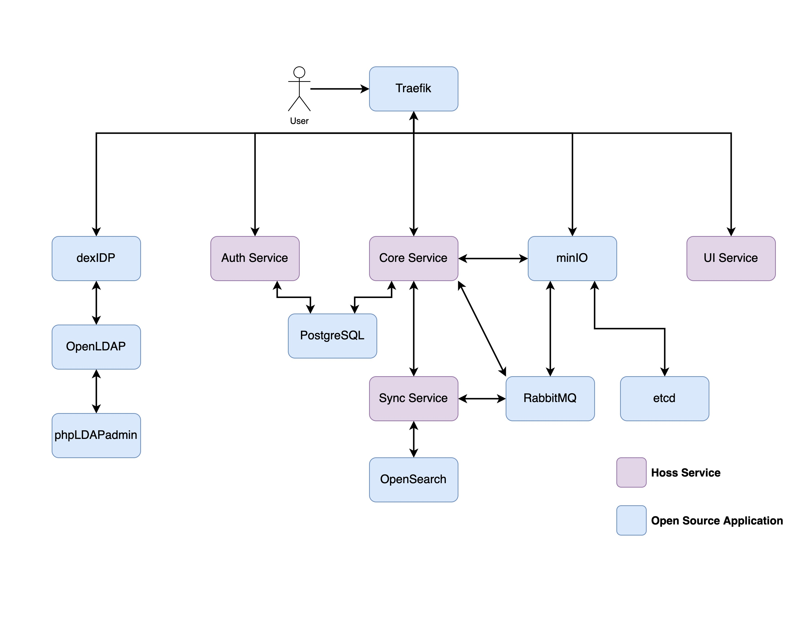
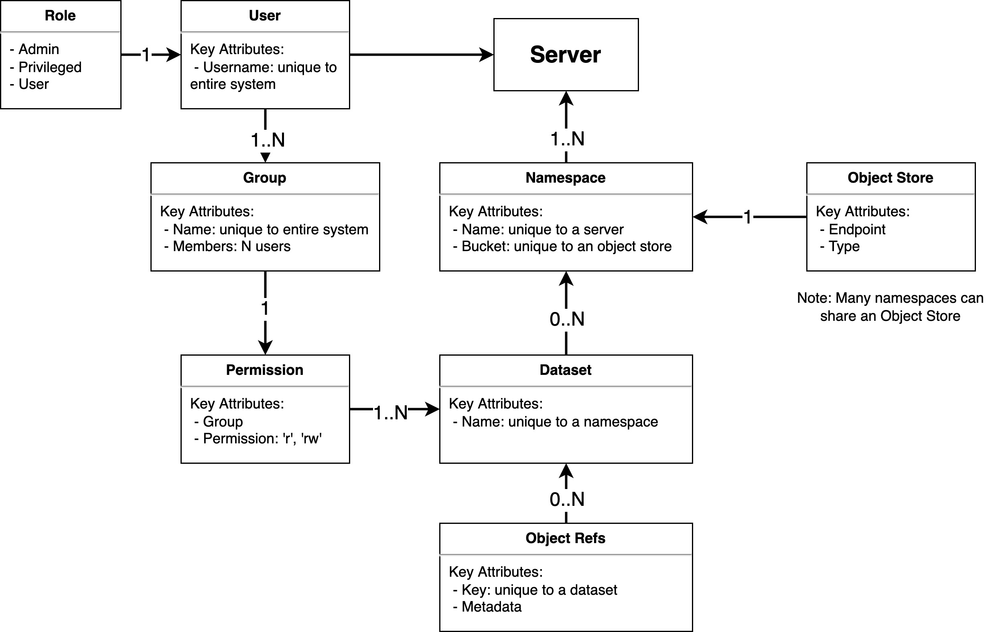

# Hoss High Level Design

## Requirements/Capabilities

1. Must provide S3 API on-premise on top of NAS storage
2. Must work on top of AWS S3
3. Must integrate with traditional user accounts (username/password) and manage IAM credentials
4. Must manage IAM policies automatically
5. Should integrate with enterprise auth systems
6. Must organize data logically into “datasets”
7. Must manage permissions between users and datasets
8. Should support groups
9. Must support tiering/syncing between on-premise and cloud object storage
10. Must have a simple administrative UI
11. Must have a file browser interface for novice users
12. Must support searching metadata
13. Must have an API and client library for skilled users

## Architecture

A Hoss "server" is the collection of services and 3rd party open source applications. The system runs in containers via Docker Compose. Not all services are required depending on your desired configuration and feature set. These configuration choices are documented in the admin docs. Also, the system in theory does not need to be deployed on a single server, and is architected to scale services independently, but currently most deployments do utilize a single server configuration.

### Hoss Services
- **Core**: The Core service provides the primary REST API for the server.
- **Auth**: The Auth service manages authentication, personal access tokens, groups, and JWT generation. It interfaces with Dex and is the source of JWTs used throughout the Hoss system.
- **Sync**: The Sync service monitors bucket events and API notifications. It performs sync operations, makes requests to index metadata, and handles other API events.
- **UI**: The UI service serves the Hoss single page web application.

### 3rd-Party Open Source Applications
- **Dex**: Dex is an identity service that uses OpenID Connect to drive authentication for other apps. The Auth service uses Dex to authenticate users and access role information before generating the appropriate JWTs.
- **OpenLDAP**: OpenLDAP is an open source implementation of the Lightweight Directory Access Protocol. This service is run as an internally hosted authentication provider if no external provider is configured.
- **phpLDAPadmin**: phpLDAPadmin is a web-based LDAP client. This service is enabled if OpenLDAP is enabled. It is not exposed to the external network and is only available on localhost:6443. 
- **PostgreSQL**: PostgreSQL is the SQL database used by the Core and Auth services to maintain application state.
- **minIO**: minIO is an object store that can be run on-premise. It is configured to run in "gateway" mode to run on top of existing storage. While this configuration is incredibly easy and quick to just "work out of the box", it will have performance limitations. You can run multiple nodes to help with this.
- **etcd**: etcd is a strongly consistent, distributed key-value store that is used by minIO to store policies and credentials. 
- **RabbitMQ**: RabbitMQ is an open source message broker that is used by minIO for bucket and API events. These events are consumed by the sync service to sync data and index metadata.
- **Opensearch**: OpenSearch is a community-driven, open source search and analytics suite derived from Apache 2.0 licensed Elasticsearch 7.10.2 & Kibana 7.10.2. It is used to index and search metadata
- **Traefik**: Traefik Proxy is an open-source Edge Router that makes it easy to route traffic to the various services

## Data Model

This diagram _roughly_ describes the data model used by the core service. For full details you should really review the models directly in the code. It is useful though because it provides the high-level mental model when thinking about how the code and data is organize. Servers contain namespaces, which map to a bucket, and contain datasets, which contain objects.

## Credential and Policy Management

Users get a short-lived JWT after a successful login. Users can also get a short-lived JWT by exchanging a Personal Access Token (PAT). With a valid JWT, a user can request STS credentials to an object store. When this happens, the system will re-render their IAM policy before generating short-lived STS credentials.

IAM policies are based on a user's permissions in the system. If no permissions are granted a null policy will be rendered, revoking access to the underlying bucket. 

A dataset is represented in the object store as a prefix with the same name as the dataset name. When granted access to a dataset, an entry in the IAM policy is added to give either read-only or read-write access to the prefix within the bucket. These policies can be arbitrarily complex as users are granted access to more data.

## Roles

The system has the concept of roles. Roles are mapped from the authentication provider via the auth service. There are three roles; admin, privileged, and user. Roles are documented in the [admin docs](https://hybrid-object-store.readthedocs.io/en/latest/maintenance/roles.html)

## Permissions

Permissions are applied between a group and a dataset. The permission level can be read-only or read-write. Because permissions are only between groups and datasets, all users are put into their own "default" group so you can still easily apply permissions to individuals. No other users are in default groups.

## Syncing

The Hoss can sync data between two datasets in two namespaces. The typical configuration is syncing the _same_ namespace and _same_ datasets between two servers to build some hybrid cloud workflow.

1-way and 2-way sync is supported. You must configure a namespace for syncing first. In doing this, API events are enabled and the sync service starts listening for events. 

The sync service is always listening for bucket events, regardless of the sync configuration, to index metadata.